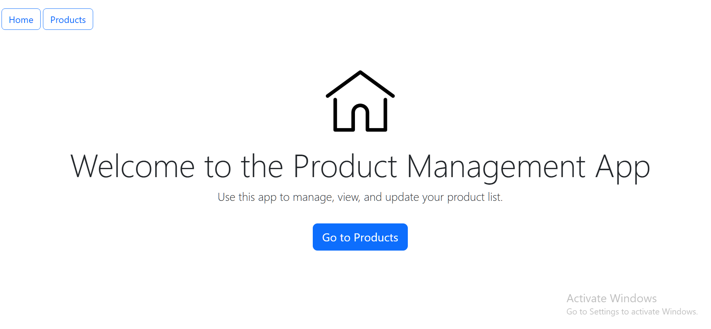
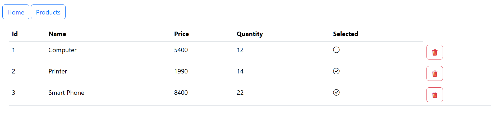
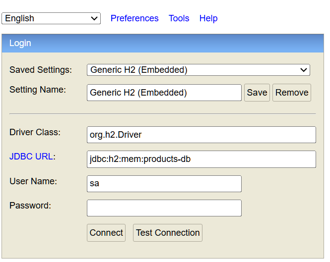
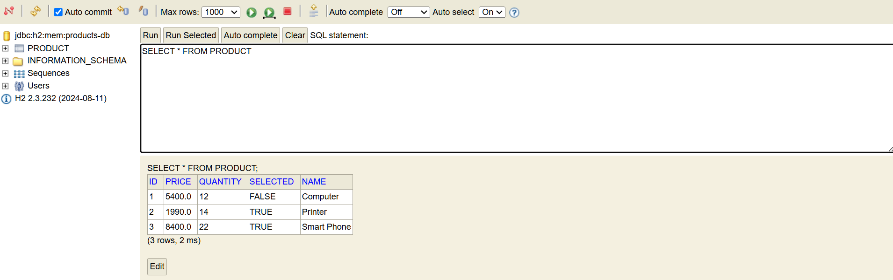

# 🛒 Product Management System

A full-stack web application for managing products, built using **Spring Boot** for the backend and **Angular** for the frontend. It allows users to view, delete, and inspect products, with data stored in an in-memory **H2 database**.

---

## 📸 Screenshots

**Home Page**



**Product Page**



**H2 DataBase**




---

## 📸 Tech Stack

| Layer    | Technology                     |
| -------- | ------------------------------ |
| Frontend | Angular 17                     |
| Backend  | Spring Boot 3                  |
| Database | H2 (In-memory)                 |
| Language | Java 17, TypeScript            |
| Tools    | Maven, Angular CLI, H2 Console |

---

## 📂 Project Structure

**Front End (Angular)**
```
product-management/
├── img/
├── node_modules/
├── public/
├── src/
│   └── app/
│       ├── home/
│       │   ├── home.css
│       │   ├── home.html
│       │   ├── home.spec.ts
│       │   └── home.ts
│       ├── products/
│       │   ├── products.css
│       │   ├── products.html
│       │   ├── products.spec.ts
│       │   └── products.ts
│       ├── services/
│       │   ├── product.spec.ts
│       │   └── product.ts
│       ├── app.config.ts
│       ├── app.css
│       ├── app.html
│       ├── app.routes.ts
│       ├── app.spec.ts
│       └── app.ts
├── index.html
├── main.ts
├── styles.css
├── .editorconfig
├── .gitignore
├── angular.json
├── note.txt
├── package.json
├── package-lock.json
├── README.md
├── tsconfig.app.json
├── tsconfig.json
└── tsconfig.spec.json

```
**Back End (Spring Boot)**

```
Product-REST-API/
├── src/
│   └── main/
│       └── java/
│           └── ma/
│               └── youhad/
│                   └── productrestapi/
│                       ├── ProductRestApiApplication.java
│                       ├── entities/
│                       │   └── Product.java
│                       ├── repository/
│                       │   └── ProductRepository.java
│                       └── web/
│                           └── ProductRestAPI.java
│
├── src/
│   └── main/
│       └── resources/
│           ├── application.properties
│           └── static/
│
├── mvnw
├── mvnw.cmd
├── pom.xml
└── README.md

```

---

## 📸 Backend - Spring Boot

### Main Features:

- RESTful API using @RestController 
- JPA Entity Product with fields:
     - id, name, price, quantity, selected 
- ProductRepository for database operations 
- Auto-populated sample data on startup

| Method | Endpoint         | Description          |
| ------ | ---------------- | -------------------- |
| GET    | `/products`      | Get all products     |
| GET    | `/products/{id}` | Get product by ID    |
| DELETE | `/products/{id}` | Delete product by ID |


### Example JSON Response:


### H2 Console:

- Access via http://localhost:8080/h2-console
- Use JDBC URL: jdbc:h2:mem:products-db

---

### 💻 Frontend - Angular

## Main Features:

- Fetch product list from REST API 
- Display product details 
- Delete products 
- Angular service to handle HTTP calls 
- Responsive UI

Runs on http://localhost:4200

---

## ⚙️ Getting Started

### Backend

```
cd Product-REST-API
./mvnw spring-boot:run
```
### Frontend

```
cd product-management
npm install
ng serve
```

Then go to: http://localhost:4200

### 🔐 H2 Database Access

Access URL: http://localhost:8080/h2-console

---

## 🌍 Cross-Origin Configuration

CORS enabled in Spring Boot:
```
@CrossOrigin("http://localhost:4200")
```
---
## 🧠 Key Concepts & What I Learned

- RESTful backend development using Spring Boot 
- Angular client development with service architecture 
- Connecting Angular to Java backend via HTTP 
- Initializing in-memory data with CommandLineRunner 
- Working with @Entity, @RestController, @CrossOrigin, and more 
- Using Angular HttpClient for REST API calls

---

##  📜 License

This project is licensed under the MIT License.

## 📁 Resources

| Item          | Path or Link                       |
| ------------- | ---------------------------------- |
| Frontend Code | `/product-management/`             |
| Backend Code  | `/Product-REST-API/`               |
| H2 Console    | `http://localhost:8080/h2-console` |
| API Base URL  | `http://localhost:8080/products`   |

